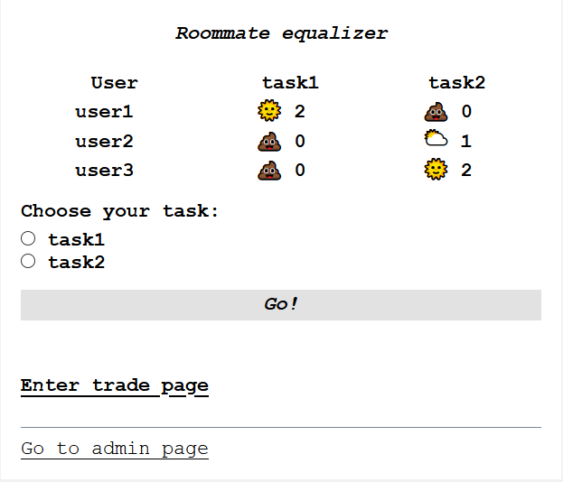
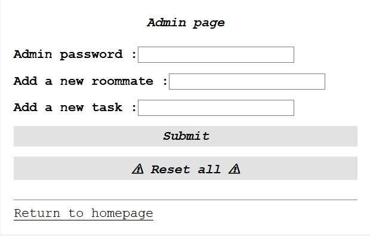
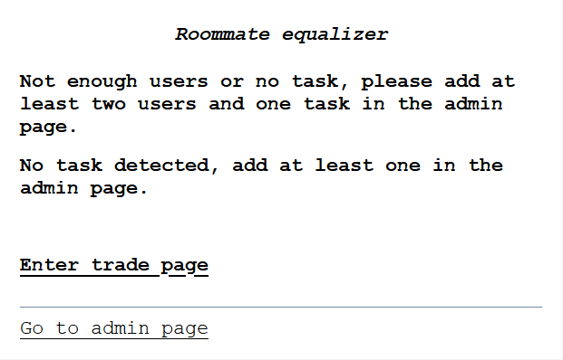
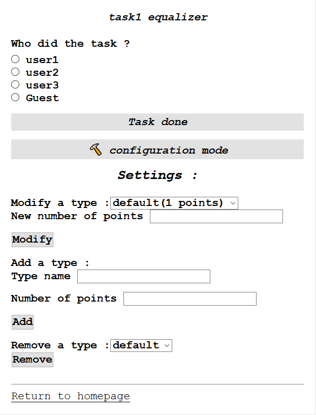
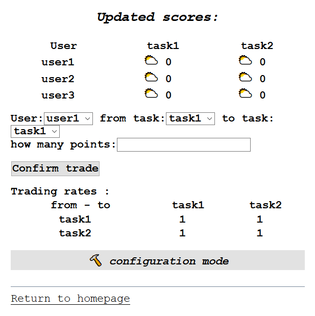
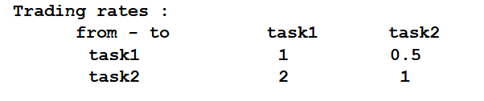

# Roommate equalizer

This app aims to balance tedious but necessery tasks among roommates, like dish washing or dust cleaning.

# How does it work ?

Each roomate has a score for each task. When a task is performed, all roommates' scores relative to this task are updated.
A trading system between tasks is implemented, so one can trade point from one task to another given a trading rate.
After a task is performed, a reward is given.

## Install the app on your system

This app is designed to be used in a web server. However, you can use it localy with tools like [Wampserver](https://sourceforge.net/projects/wampserver/files/) on Windows.
After the tool is installed and launched, clone this repository on your app directory (for `Wampserver` users it would be something like `C:\wamp64\www\roommate-equalizer`) and search its adress with your favorite browser : `http://localhost/roommate-equalizer/index.php`.

## Getting started

### Create the dataset :

If the database is not cleared, you can `Go to admin page` then select `Reset All` and confirm it.

By default, the password is `password`, but you can change it by editing the `admin.php` file, third line --- this password is needed to add new roommates or new tasks. To do so, just write the name of the roommate/task in the right area and click on `Submit`. A confirmation message will be displayed.

***Note: the scores will only be displayed if there are at least two users and one task.*** 

### Move to a task

In order to select a task, one just has to click on the wanted task and click on `Go!`.

### Configure the tasks

Each task can have different types, like the task `dishes` can have two types `breakfast` and `meal`. By default, the newly created task has one type `default` corresponding to one point. One can modify, add and remove types of a given task when surfing on the page of the said task:
* click on `configuration mode` ;
* the settings will appear, along with all the options ;
* when a change is made, the data is immediately updated.

When a task has multiple types, they can be selected the same way as the user who did the task.

***Note: for each task, the user can be a `Guest`, who will receive a reward but not affect the scores.***

### Trade points

Any user can decide to transfer his points from one task to another. To do so, he must click on `Enter trade page`, then select the user who wants to trade, the task from which his points will be taken, and the task to which his points will be added. Click on `Confirm trade` to validate, and all the scores will be updated.

Below the `Confirm trade` button are shown the trading rates. By default, all of them are equals to one. It means that one point of _task A_ is equivalent to one point of _task B_.
To change these rates, one has to click on `configuration mode` to open the settings. Here, one has to select the rate to be changed, and insert the new value before clicking on `Modify`.

In this example, one point of `task2` is equivalent to two points of `task1` ; it means that if a user trades two points from `task2` to `task1`, he will lose two points from `task2` and gain four in `task1`.

***Note: if one changes a rate from _task B_ to _task A_, then the inverse rate (from _task A_ to _task B_) will be automaticaly inserted.***

### Reward ###

In order to reward the user who performed a task, he will be redirected (after submitting his task) to a new page which displays a picture. This picture is found from its url, which is randomly chosen from the list `data/url.txt`. By default, we provided sixty url's of cinema actresses we like ; feel free to put whatever image's url you'd like in the file.

The new scores are also displayed under the reward.

# Repository description

There are a few files in this repository:
* the `.php` files which corresponds to all pages of the website (the main one being `index.php`),
* the `style.css` file which corresponds to the graphic data for the pages,
* the `data/` folder which contains the database of the site (`config.json` to store the data of all tasks, `scores.json` to store scores of each user for each task, `trading_rates.json` to store the trading rates between tasks, `url.txt` to store all rewards' url's and `selected_task.txt` which is mostly empty but temporary contains one line of information for the site to run),
* the `readme_assets/` folder which contains all the images of this `README`.